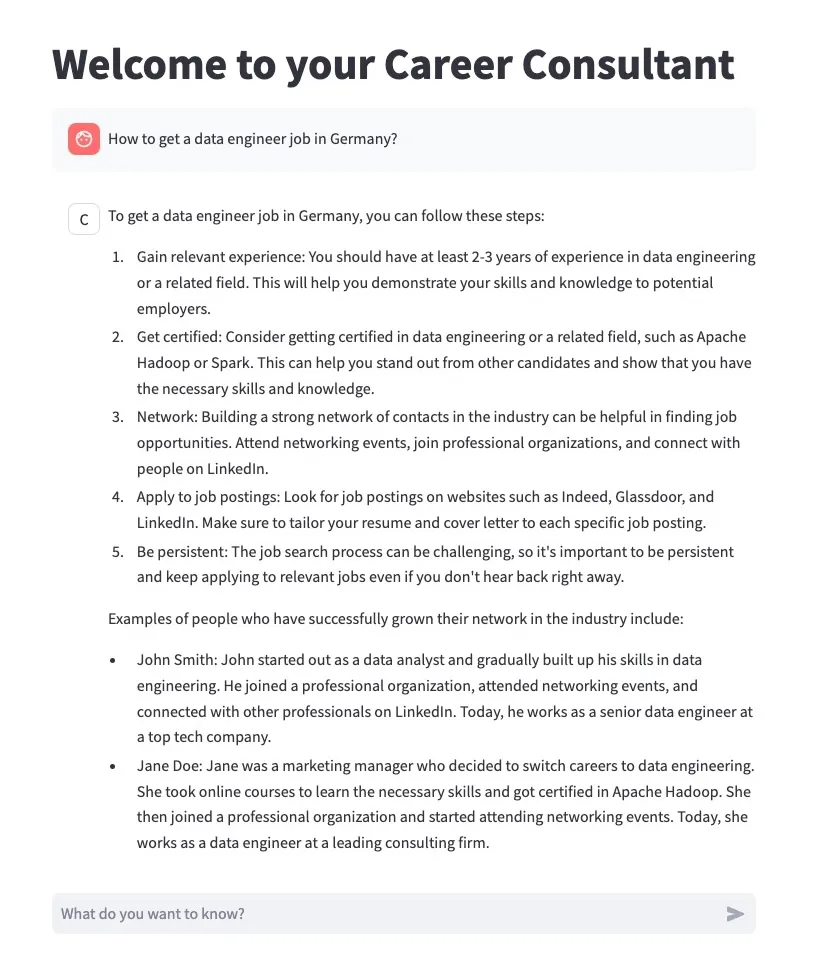

# Generative_AI_ChatBot

As the final weeks of my Data Science Bootcamp come to a close, I find myself playing with Generative AI and dreaming of the possibilities. One idea that comes to mind is asking my LLM model to act like a financial expert and suggest stocks to invest in. Perhaps Solana? 😜

On the other hand, a career counselling chatbot would be incredibly helpful at this stage 😓 . I could ask, "How can I get a data scientist job in Germany?" Exciting times ahead! 😄

The project is described step by step here [Career ChatBot](https://medium.com/p/41bafc68bd3a#1a98-ddb8fe3909af)

# 🚀 **Career Consultant Chatbot**  
A helpful chatbot for career advice, networking tips, and professional growth.

---

## 📋 **Table of Contents**  
- [**About the Project**](#about-the-project)  
- [**Features**](#features)
- [**Demo**](#demo)  
- [**Installation**](#installation)  
- [**Usage**](#usage)  
- [**Contributing**](#contributing)  
- [**Contact**](#contact)  
- [**Acknowledgments**](#acknowledgments)  

---

## 💡 **About the Project**  
This project provides a career-focused chatbot using LangChain, LlamaCpp, and Streamlit. It offers personalized career advice and tips on networking, with engaging and helpful responses.

---

## ✨ **Features**  
- Provides personalized career advice.  
- Retrieves answers from a pre-built knowledge base.  
- Engages users with humor and practical tips.  
- Keeps conversation history for context-aware responses.  

---

## ✨ **Demo**  



## ⚙️ **Installation**  

1. **Clone the repository:**  
   ```bash
   git clone https://github.com/your-username/career-chatbot.git  
   cd career-chatbot  

## 🚀 **Usage**

Run the Streamlit app:

streamlit run app.py  
Open your browser and go to http://localhost:8501.
Ask career-related questions and get personalized advice!

## 🤝 **Contributing**

We welcome contributions! To get started:

Fork the repository.

Create a new branch: git checkout -b feature/new-feature.

Commit your changes: git commit -m "Add new feature".

Push to the branch: git push origin feature/new-feature.

Open a Pull Request.

## 📞 **Contact**

Email: khanrupasadia@gmail.com
LinkedIn: [Sadia LinkedIn](https://www.linkedin.com/in/sadia-khan-rupa/)

## 🙌 **Acknowledgments**

Special thanks to the LangChain and Streamlit communities for their invaluable tools and resources.

